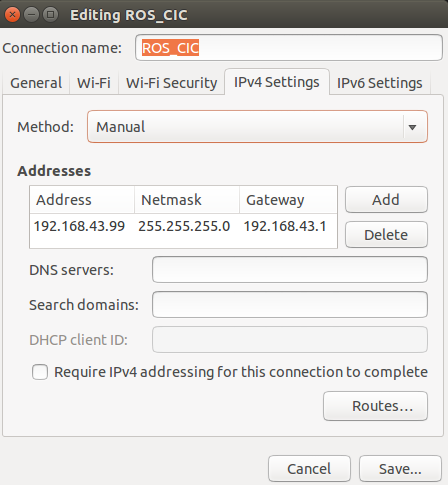
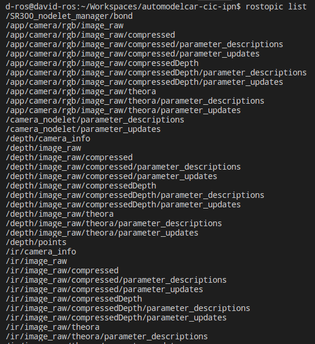
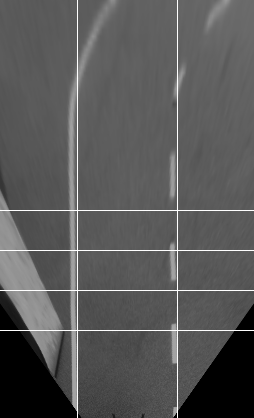

# AutoModelCar CIC IPN
This is CIC's repository package for the [AutoModelCar](https://github.com/AutoModelCar). This repository contents the code for the next modules:

- Image processing and camera adjustment (C++ and Python).
- Lane follower (C++ and Pyhton).
- Intersection detector (C++ and Pyhton).
- Obstacke detection (C++ and Pyhton).
- Joystick (C++).
- Parking (Python)

The ROS distro used is Indigo along with Ubuntu 14.10 LTS. All the C++ and Pyhton Modules are included in different ROS packages. The launch files are also included.

**IMPORTANT: Before starting, make sure you have ROS and all it's deppendencies properly installed on your PC! Otherwise, visit the [ROS Tutorials](http://wiki.ros.org/ROS/Tutorials/InstallingandConfiguringROSEnvironment). Its is also recomended to install [VS Code](https://code.visualstudio.com/download), this is a code editor with a terminal included and compatible with Git commands, this will simplify some work in the future.**

## Establish communication with the car
First set the correct parameters to the Ad-hoc network. Click the wifi icon and then the "Edit Connections" option.

Select the automodel's wifi "ROS_CIC" and edit it. On "IPv4 Settings" set the next parameters as follows:

* Method: Manual
* Address: 192.168.43.99
* Netmask: 255.255.255.0
* Gateaway: 192.168.43.1

Figure 1: Window of automodel network properties. 

**IMPORTANT: Its recommended not to repeat the same adress on different computers.**

Once you have saved the changes, reconnect to the network and on a terminal type the next command to ensure you have communication.

    ping 192.168.43.102

If established correctly something similar should appear in your terminal.

Figure 2: Results of ping command with a successful communication.

Now in a new terminal open and edit the .bashrc file, located on the home directory folder. This file dictates where  the master will be running, either local or on car.

    cd
    sudo gedit .bashrc

At the bottom of the file copy the next lines.

    #Run the master on the car
    export ROS_MASTER_URI=http://192.168.43.102:11311
    export ROS_HOSTNAME=192.168.43.97

    #Run the master on local
    #export ROS_MASTER_URI=http://localhost:11311
    #export ROS_HOSTNAME=localhost

Save the file and source it.

    source .bashrc

Whenever you want to run on local, comment the two lines below "Run the master on car"; and if you want to run on the car, comment the two lines below "Run the master on local"

Finally, with the connection already established type the next command:

    rostopic list 

If the master was found, you should see the next list.

Figure 3: List of topics from the odroid.

## Cloning the repository
Create a new folder named "Workspaces"

    mkdir Workspaces

Access the folder

    cd Workspaces

In order to start working with the code, first clone the repository on your /Workspace folder by typing:

    git clone https://github.com/Conilo/automodelcar-cic-ipn.git

## Build the code:
Then, it's necesarry to compile the code (also after modifiying any file or node source). To do so, type:

> bash compile.bash

To compile the code in "release mode" add the `-s` flag:

> bash compile.bash -s

## Run the code

There are different run modes available, depending on the function needed. The next subsections explain each mode functionalities and how to run them.

### Camera adjustment mode

To run the camera adjustment mode, inside VSCode open the downloaded folder and using it's terminal type:

> bash start.bash -cm

A debug window will be displayed with a chessboard layout (see figure 4). To adjust the camera, you will need a printed chesboard pattern of 35x35 [cm]. Lay down the printed pattern in front of the camera and modify the parameters in the camera calibration launch file in order to match the chessboard pattern with the one displayed. Those parameters are:

- Pixel to cm ratio in the X-axis.
- Pixel to cm ratio in the Y-axis.
- Scaling factor for the X-axis.
- Scaling factor for the Y-axis.
- Four points to wrap the image in birdview.

Figure 4: Chessboard pattern displayed on camera adjustmen mode.

### Autonomous mode
To run the code on autonomus mode, with a new terminal acces the odroid and type:

    roslaunch  cic full.launch

If any error occurs when this command is executed, it will be necessary to update and build the code inside the car, this is done fist by running the `update_car.bash` file, which is located in the `/automodel-cic-ipn` folder.

Using the terminal from VSCode type:
	
    bash update_car.bash

Once the update has finished, in a new terminal access the odroid and build the recently updated code.
	
    ssh root@192.168.43.102
	roscd cic
	cd ..
	catkin build cic
After the process has finished, try again to launch the autonomus mode.

 
Inside this launch file, several nodes are initialized using specific parameters to be set by the user.
The next is the node list with the description of some relevant parameters:

* Image processing: in this node, color, size and perspective mapping trasnformations are applied in order to get parallel lane lines, and reduced noice. 
* Lane detection: a find-peaks algorithm and a linear regression are applied to model the lane and generate a trajectory. An important parameter of this node is `direct_mode`; setting true this parameter will publish directly to the manual control topic; otherwise to publish on the manual control topic it will first go through master node. The next one is `max_vel`, which sets the maximum velocity of the automodel, its important to mention that the more negative it's, the faster it goes. 
* Crossing detection: finds a straight line and calculates deviation angle and distance respect to the car.
* Obstacle detection: this node uses data from the scan topic and using a variation of the Dbscan algorithm, the obstacles are indetified and modeled.
* Master: in this node a state machine is implemented to handle the tasks of driving, intersection approach, waitting, following, move left, move right and passing. In order to activate the passing task it's necessary to set the `passing_allowed` parameter true, then if an obstacle is detected the automodel will overtake it, otherwise it will wait for the obstacle to move.

Another important parameter to mention, which is related to different nodes, is `debug_mode`. Setting true its value will allow the user to enter in debug mode. If `run_on_car` is also set true an error will occur, both parameters can't be set true simultaneously.

### Autonomus with overtake
It is easy to modify the `full.launch` file to allow the Automodel to overtake obstacles however, by launching the `overtake.launch` file there is no need to edit anything. Acces the odroid and type:

    roslaunch cic overtake.launch

## Parking mode
To run the parking mode, with a new terminal acces the odroid and type:

    roslaunch  cic parking.launch

## Run the code with bags
To run the code with bags on the PC, having a ROS master running is needed,  you can do it by typing:

> roscore

or 

> bash start.bash -mode

where "mode" is to be replaced with the desired mode. Then, to play the desired bag, type:

> bash play_bag.bash desired_bag

where the "desired_bag" is the file name without extention.

**IMPORTANT: before playing a ROS bag file, make sure that a bags/ folder with your bag inside it exists in your working space. Otherwise, you may need to modify the play_bag.bash file to adjust the path to your bags container folder.**

## Contact:
If you need more info about the code, please contact:

* Project Supervisor:
Erik Zamora Gómez (e-mail: ezamora1981@gmail.com).

* Project Manager: 
Cesar Gerardo Bravo Conejo  (e-mail: conilo@gmail.com).

Student assistants:
- Brenda Camacho Garcia (e-mail: brendacg616@gmail.com).
- Esteban Iván Rojas Hernández (e-mail: rojasesteban23@gmail.com).
- David Alejandro Toro Sandoval (e-mail: toro.david@hotmail.com).
